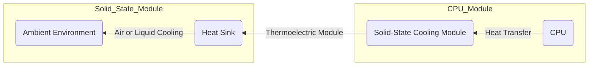

# Schematic

```mermaid

graph RL
  subgraph CPU_Module
    A(CPU) -->|Heat Transfer| B(Solid-State Cooling Module)
  end
  subgraph Solid_State_Module
    B -->|Thermoelectric Module| C(Heat Sink)
    C -->|Air or Liquid Cooling| D(Ambient Environment)
  end

```

