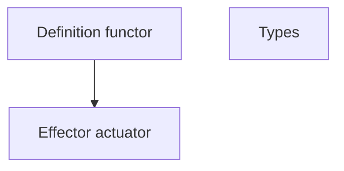
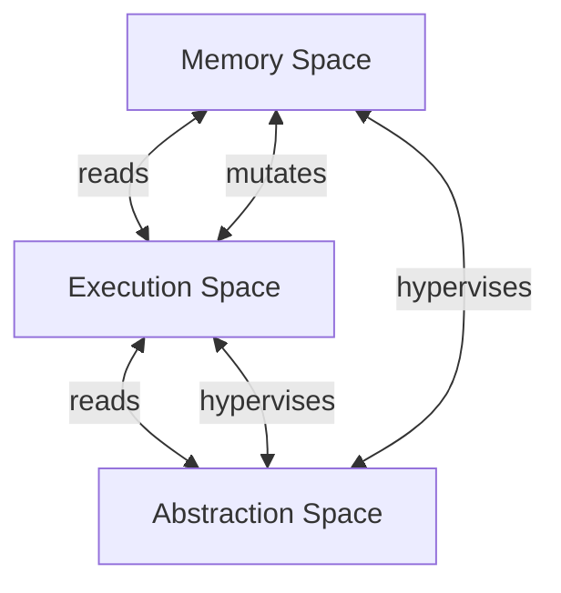

# Architecture
##### [[Projects/Blakprint/Blakprint|Blakprint]]

![[blakprint-logo.png]]

## Diagram

## Abstract

# Metadata
> [!info]- *Metadata*
> **Date** = 2023-10-17
> **Status** = [#in-progress]