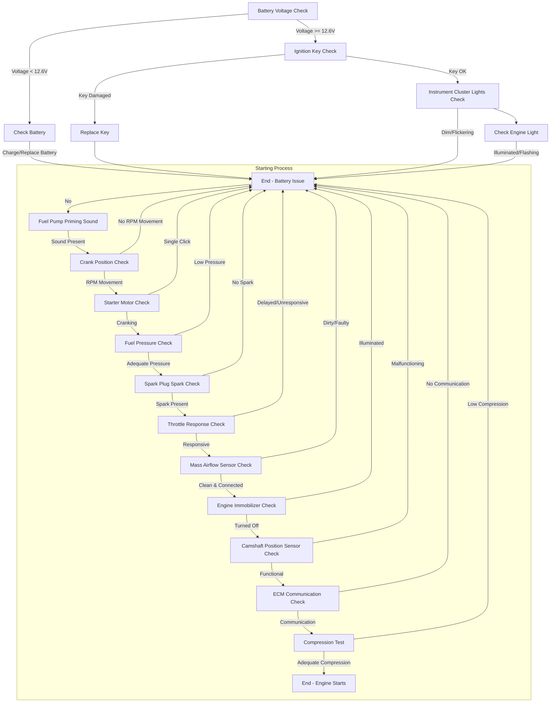

```mermaid

graph TD
A[Battery Voltage Check] -->|Voltage < 12.6V| B
A -->|Voltage >= 12.6V| C
B[Check Battery] -->|Charge/Replace Battery| G[End - Battery Issue]
C[Ignition Key Check] -->|Key Damaged| D
C -->|Key OK| E
D[Replace Key] --> G
E[Instrument Cluster Lights Check] -->|Dim/Flickering| G
E --> F
F[Check Engine Light] -->|Illuminated/Flashing| G

subgraph Starting Process
  G -->|No| H[Fuel Pump Priming Sound]
  H -->|Sound Present| I[Crank Position Check]
  I -->|No RPM Movement| G
  I -->|RPM Movement| J[Starter Motor Check]
  J -->|Single Click| G
  J -->|Cranking| K[Fuel Pressure Check]
  K -->|Low Pressure| G
  K -->|Adequate Pressure| L[Spark Plug Spark Check]
  L -->|No Spark| G
  L -->|Spark Present| M[Throttle Response Check]
  M -->|Delayed/Unresponsive| G
  M -->|Responsive| N[Mass Airflow Sensor Check]
  N -->|Dirty/Faulty| G
  N -->|Clean & Connected| O[Engine Immobilizer Check]
  O -->|Illuminated| G
  O -->|Turned Off| P[Camshaft Position Sensor Check]
  P -->|Malfunctioning| G
  P -->|Functional| Q[ECM Communication Check]
  Q -->|No Communication| G
  Q -->|Communication| R[Compression Test]
  R -->|Low Compression| G
  R -->|Adequate Compression| S[End - Engine Starts]
end

```

---

> [!info]-
> **Project** = [[Desirable Solutions/Projects/Oasis/Oasis]]
> 