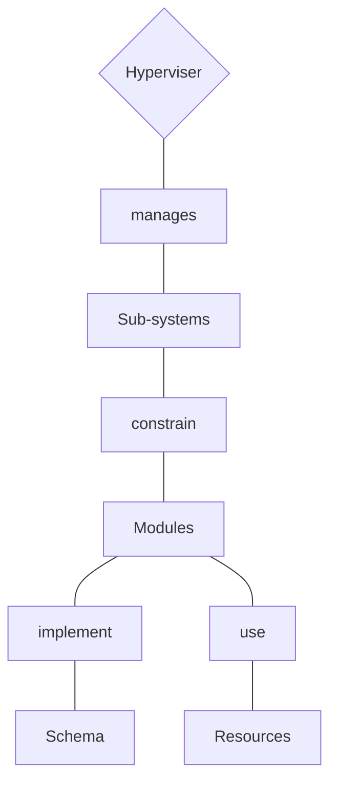

# O.A.S.I.S
##### Optimized Autonomous System for Intelligent Sustainability

> [!info]- *Oasis Systems*
> An intelligent, user-oriented system engineered for the streamlined development and orchestration of critical resources and toolkits for sustainable home living. 
> This sophisticated system leverages advanced AI algorithms and machine learning techniques to dynamically manage and optimize renewable energy sources, waste management solutions, water conservation technologies, and other sustainable home infrastructure components. 
> The system's intuitive interface and smart automation capabilities facilitate seamless user interaction, providing an inclusive solution that pioneers sustainable living into the future.

![[oasis.png]]

## General Architecture

# Metadata
> [!info]- *Metadata*
> **Organization** = [[Organizations/Desirable Solutions/Desirable Solutions|Desirable Solutions]]
> **Type** = [[Desirable Solutions/Projects/Projects|Projects]]
> **Version** = [`1.0.0`]
> **Website** = [**🔗External Link**](https://oasissystems.bio)
