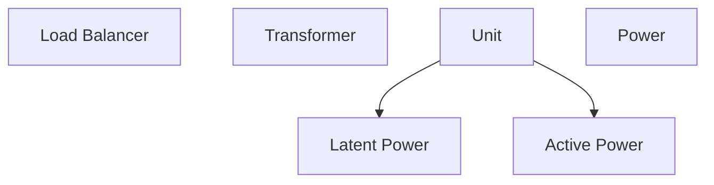

# E.M.O.S
##### **Electromagnetic Transduction System**


### Modules
#### [[Transmugulator]]


## Architecture

```math

# Loads
signa_base = 3.0
signal = signa_base * 3

# Power Sources
watt_hours = signal / 2 

```

> A B Cs of Low Voltage Tech : Always be Charging. 


---
> [!info]-
> **Type** = [[Projects/Oasis/Sub-systems/Sub-systems|Sub-systems]]
> **Project** = [[Desirable Solutions/Projects/Oasis/Oasis]]
