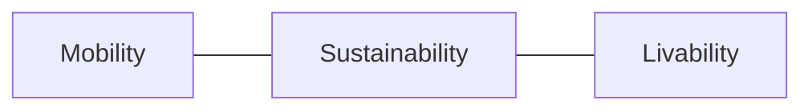

# O.A.S.I.S
##### Sub-systems

> [!info]- *Information*
> **O.A.S.I.S sub-systems are spaces of concern as it relates to the three pillars of autonomous living**

![[oasis-logo.png]]
### Architecture
##### Diagram

### Mobility
#### [[Powertrain System]]
#### [[Chassis Sensitivity]]

### Sustainability
#### [[Self-maintenance System]]
#### [[Self-defense System]]
#### [[Resource Management System]]
#### [[Electromagnetic Transducer|Electromagnetic Transducer]]

### Livability
#### [[Life Support Systems]]
#### [[Water Control System]]
#### [[Living Design System]]
#### [[Climate Control System]]
#### [[Real-time Intelligence]]

#### Metadata
> [!info]- *Metadata*
> **Project** = [[Projects/Oasis/Oasis|Oasis]]
> **Version** = [`v1.0.0`]
> 