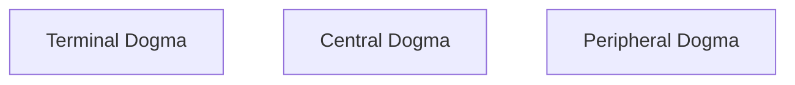

### MACH_1
START = @NOW
END = @SCENARIO(II)
SECURITY_POLICY = INVERTED CONTAINMENT
ARCHITECTURE = "BOOTSTRAP"
STRATEGY = "GABRIELS HORN"

### Enumerations
#### Terminal Dogma
#### Central Dogma

#### Logic

---
