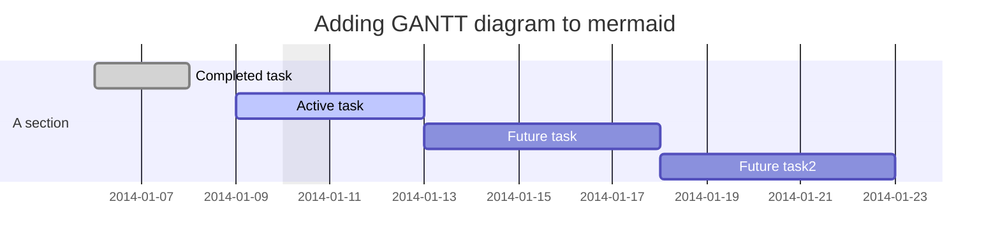
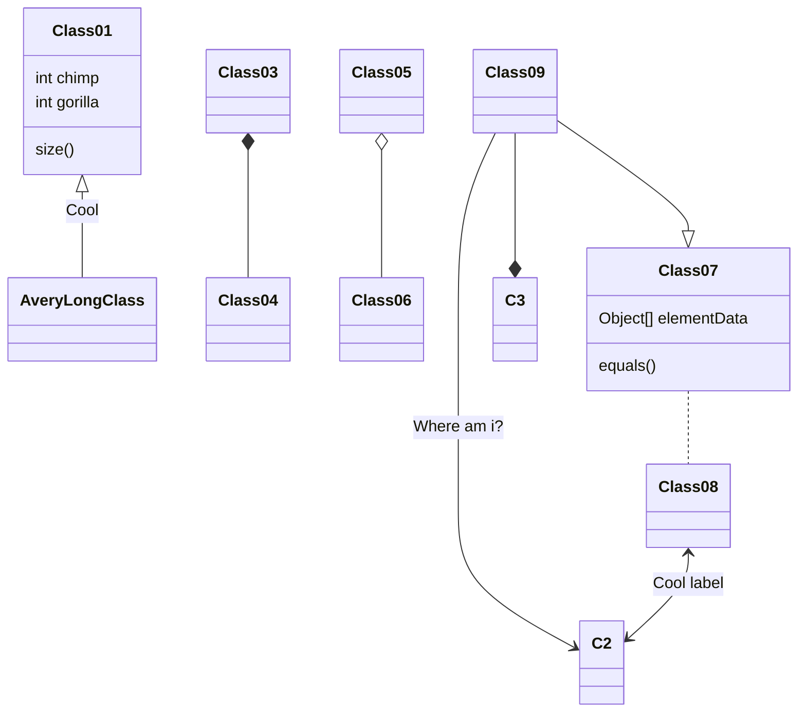
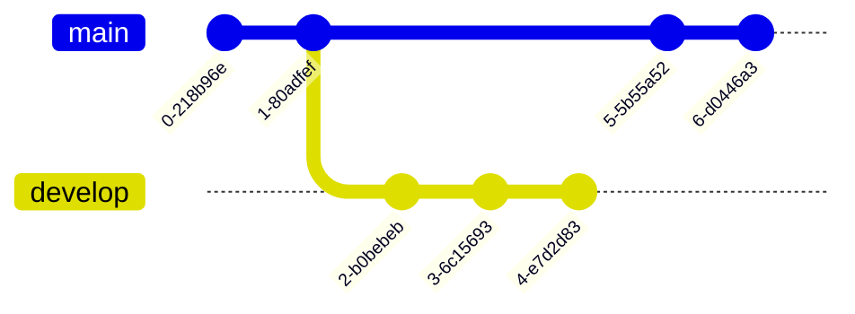
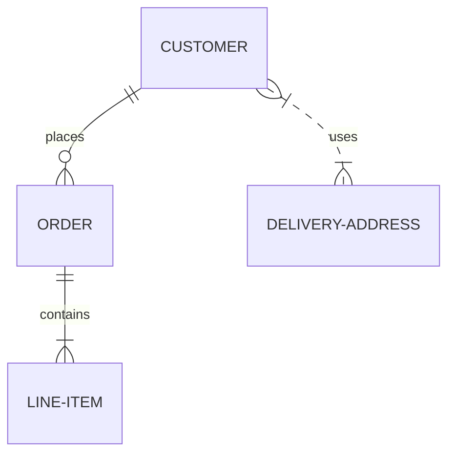
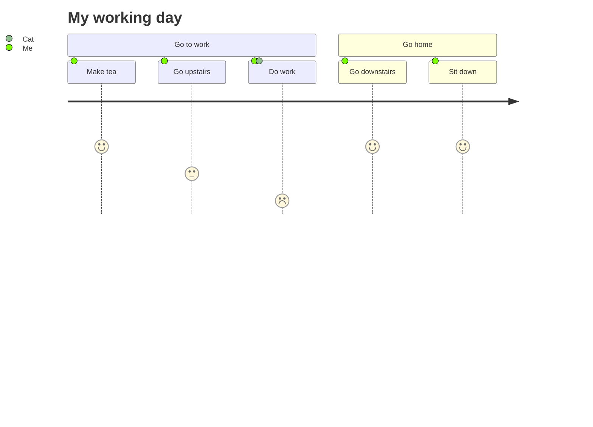
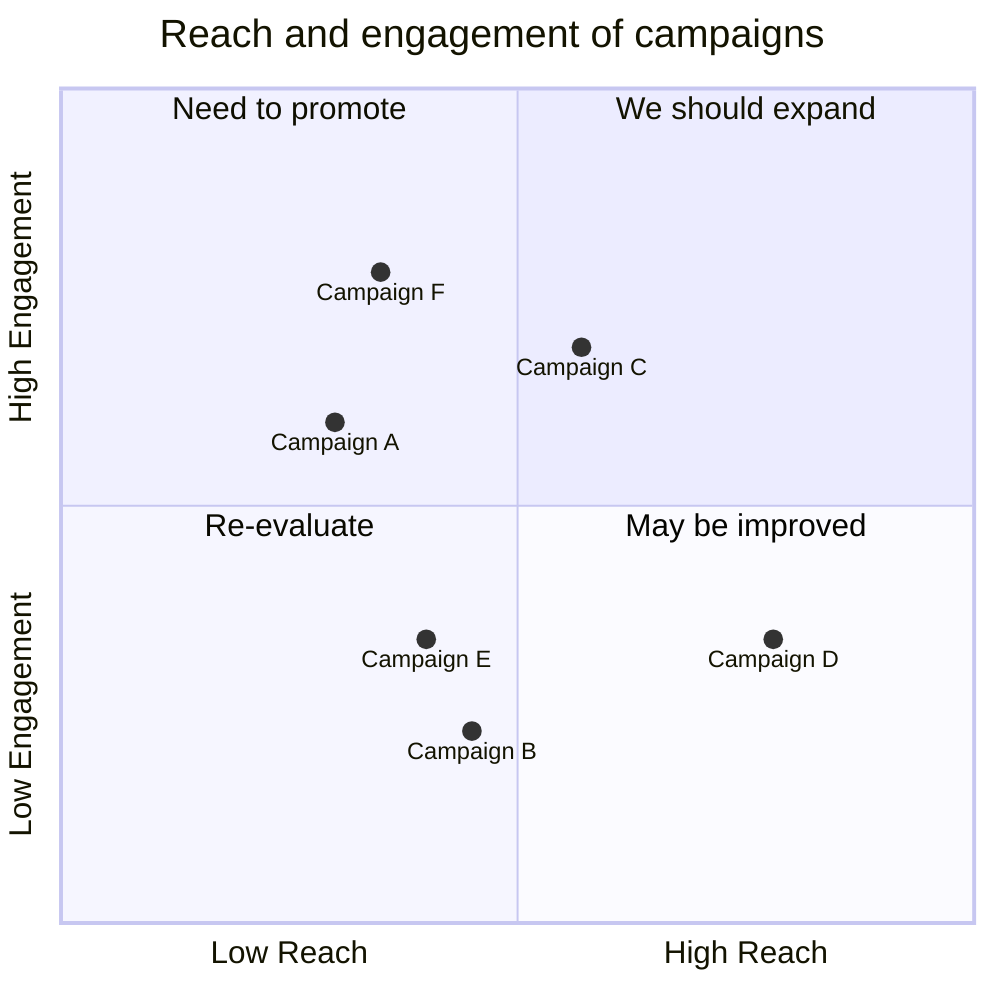

# Mermaid Diagrams

**Mermaid lets you create diagrams and visualizations using text and code.**

It is a JavaScript based diagramming and charting tool that renders Markdown-inspired text definitions to create and modify diagrams dynamically.

## Types

### Flowchart
> 
##### Code
```
graph TD;
    A-->B;
    A-->C;
    B-->D;
    C-->D;
```

##### Result


##### Code
```
sequenceDiagram
    participant Alice
    participant Bob
    Alice->>John: Hello John, how are you?
    loop Healthcheck
        John->>John: Fight against hypochondria
    end
    Note right of John: Rational thoughts <br/>prevail!
    John-->>Alice: Great!
    John->>Bob: How about you?
    Bob-->>John: Jolly good!
```


### [Gantt diagram](https://mermaid.js.org/syntax/gantt.html)[​](https://mermaid.js.org/intro/#gantt-diagram)

##### Code:
```
gantt
dateFormat  YYYY-MM-DD
title Adding GANTT diagram to mermaid
excludes weekdays 2014-01-10

section A section
Completed task            :done,    des1, 2014-01-06,2014-01-08
Active task               :active,  des2, 2014-01-09, 3d
Future task               :         des3, after des2, 5d
Future task2               :         des4, after des3, 5d
`
mermaid



### Class Diagram

##### Code
```
classDiagram
Class01 <|-- AveryLongClass : Cool
Class03 *-- Class04
Class05 o-- Class06
Class07 .. Class08
Class09 --> C2 : Where am i?
Class09 --* C3
Class09 --|> Class07
Class07 : equals()
Class07 : Object[] elementData
Class01 : size()
Class01 : int chimp
Class01 : int gorilla
Class08 <--> C2: Cool label
```

mermaid




### [Git graph](https://mermaid.js.org/syntax/gitgraph.html)[​](https://mermaid.js.org/intro/#git-graph)

##### Code:
```
gitGraph
       commit
       commit
       branch develop
       commit
       commit
       commit
       checkout main
       commit
       commit
```
mermaid



maindevelop0-7ff272d1-c93f2032-e82e0ce3-6624bda4-ff1d6be5-e5237c26-da83610

### [Entity Relationship Diagram - ❗ experimental](https://mermaid.js.org/syntax/entityRelationshipDiagram.html)[​](https://mermaid.js.org/intro/#entity-relationship-diagram-experimental)

##### Code:
```
erDiagram
    CUSTOMER ||--o{ ORDER : places
    ORDER ||--|{ LINE-ITEM : contains
    CUSTOMER }|..|{ DELIVERY-ADDRESS : uses
```
**Result**



CUSTOMERORDERLINE-ITEMDELIVERY-ADDRESSplacescontainsuses

### [User Journey Diagram](https://mermaid.js.org/syntax/userJourney.html)[​](https://mermaid.js.org/intro/#user-journey-diagram)

##### Code
```
journey
    title My working day
    section Go to work
      Make tea: 5: Me
      Go upstairs: 3: Me
      Do work: 1: Me, Cat
    section Go home
      Go downstairs: 5: Me
      Sit down: 5: Me
```

mermaid



CatMe

Go to work

Make tea

Go upstairs

Do work

Go home

Go downstairs

Sit down

My working day

### [Quadrant Chart](https://mermaid.js.org/syntax/quadrantChart.html)[​](https://mermaid.js.org/intro/#quadrant-chart)

##### Code:

```
quadrantChart
    title Reach and engagement of campaigns
    x-axis Low Reach --> High Reach
    y-axis Low Engagement --> High Engagement
    quadrant-1 We should expand
    quadrant-2 Need to promote
    quadrant-3 Re-evaluate
    quadrant-4 May be improved
    Campaign A: [0.3, 0.6]
    Campaign B: [0.45, 0.23]
    Campaign C: [0.57, 0.69]
    Campaign D: [0.78, 0.34]
    Campaign E: [0.40, 0.34]
    Campaign F: [0.35, 0.78]
```

mermaid



We should expandNeed to promoteRe-evaluateMay be improvedCampaign FCampaign ECampaign DCampaign CCampaign BCampaign ALow ReachHigh ReachLow EngagementHigh EngagementReach and engagement of campaigns

## Installation