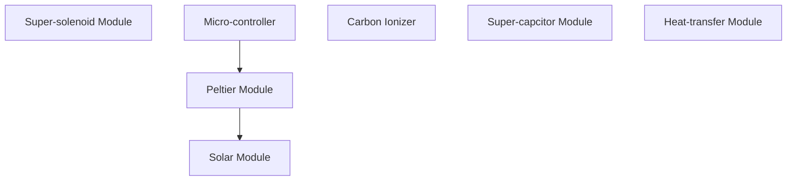

# Transmugulator

## Classes

### Class IC

### Class IC

### Class IC

### Chromodynamic Constraints

> [!info] *The Math*
>   *1 Watt = 1 Joule / Second*
>   E(0,4) ---> E(p) --> E'
>   **Water Fusion** = `334joules/gram H20`
>   **Energy Required** = `334watts`

Normally CFC’s have a higher density than most alkanes or even water. But they can still have low boiling points (compared to water). Chlorodifluoromethane [CHClF2] for example has a very low boiling point of -40.8 C and a density of around 1.4 g/cc when liquid. Another example of one that is liquid at room temperature is trichlorofluoromethane [CCl3F] which has a boiling point...

#### Metadata
> [!info]- *Metadata*
> **Project** = [[Projects/Oasis/Oasis|Oasis]]