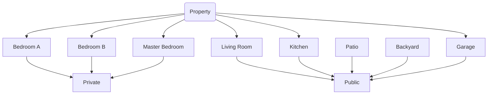

# Floor Plan
##### [[Florida Home Arbitrage]]

### [[Projects/Florida Home Arbitrage/Garage|Garage]]
### [[Living Room]]
### [[Front Yard]]
### [[Bedroom A]]
### [[Kitchen]]
### [[Bedroom B]]
### [[Master  Bedroom]]

# Metadata
> [!info]- *Metadata*
> **Project** = [[Florida Home Arbitrage]]