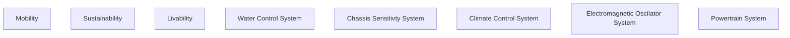
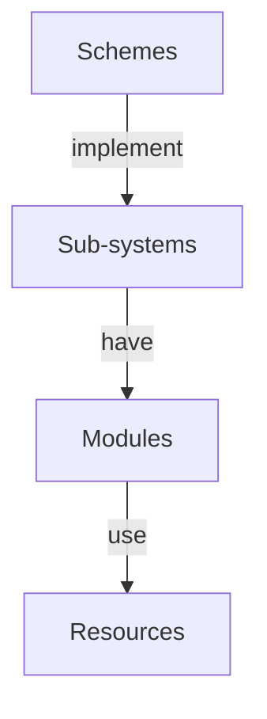
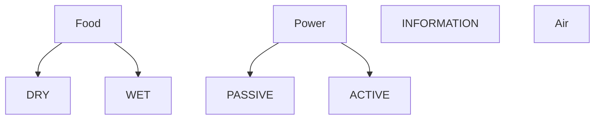

## Enumeration
**Here's how it all works**

```mermaid

graph TB

 MOBILITY["Mobility"]
 SUSTAINABILITY["Sustainability"]
 LIVABILITY["Livability"]
 
 WCS["Water Control System"]
 CSS["Chassis Sensitivty System"]
 CCS["Climate Control System"]
 EMOS["Electromagnetic Oscilator System"]
 PTS["Powertrain System"]

```

## Data
	

```mermaid

graph TB

 SUB_SYSTEMS["Sub-systems"]
 SCHEMES["Schemes"]
 RESOURCES["Resources"]
 MODULES["Modules"]


 SUB_SYSTEMS --have--> MODULES
 MODULES --use--> RESOURCES
 SCHEMES --implement--> SUB_SYSTEMS
 
```

## Spaces

```mermaid

graph TB

 FOOD["Food"]
 POWER["Power"]
 INFORMATION["INFORMATION"]
 AIR["Air"]

 FOOD --> DRY
 FOOD --> WET

 POWER --> PASSIVE
 POWER --> ACTIVE
```

---
> [!info]-
> **Case** = [[Nadine Edouarzin]]
> **Projects** = [[Desirable Solutions/Projects/Oasis/Oasis]]
> 