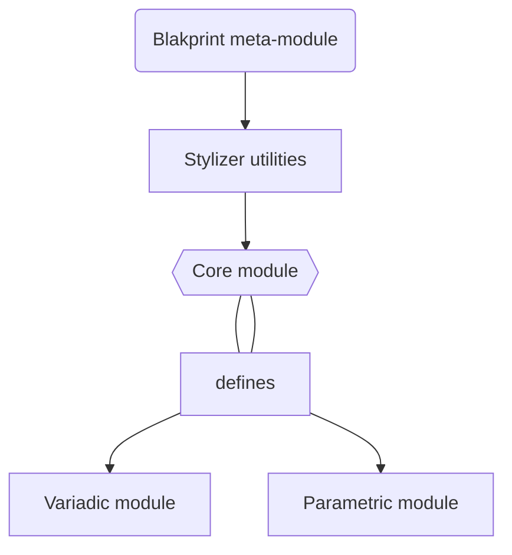

# Architecture
##### [[Projects/Tesseract/Tesseract|Tesseract]]

![[tesseract-logo.png]]

#### Core module
> the general recipe for making a component in Tesseract, aptly named `defineHyperdimensionalComponent` (a [[Projects/Blakprint/Blakprint|Blakprint]] definition). 

##### Variadic module
> This module uses TypeScript React with Framer Motion & Tailwind CSS and intelligently stores variants of component configurations & layouts. 

##### Parametric module
>This module uses a secured, string-template based, variadic model inspired by [*Alan Woa*](), creator of the [HTM]() library. Its purpose  to have multiple component variants and presets defined for one component, in  TypeScript, React. 

### Diagram

# Metadata
> [!info]- *Metadata*
> **Date** = #2023-10-12