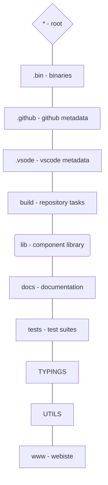

# Repository Tree
##### [[Projects/Tesseract/Tesseract|Tesseract]]

```mermaid

flowchart TD

   ROOT{"* - root"}
   BIN[".bin - binaries"]
   GITHUB[".github - github metadata"]
   VSCODE[".vsode - vscode metadata"]
   BUILD["build - repository tasks"]
   LIB("lib - component library")
   DOCS["docs - documentation"]
   TESTS["tests - test suites"]
   WWW["www - webiste"]

   ROOT --- BIN
   BIN --- GITHUB
   GITHUB --- VSCODE
   VSCODE --- BUILD
   BUILD --- LIB
   LIB --- DOCS
   DOCS --- TESTS
   TESTS --- TYPINGS
   TYPINGS --- UTILS
   UTILS --- WWW
```

# Metadata
> [!NOTE]- *Metadata*
> Content